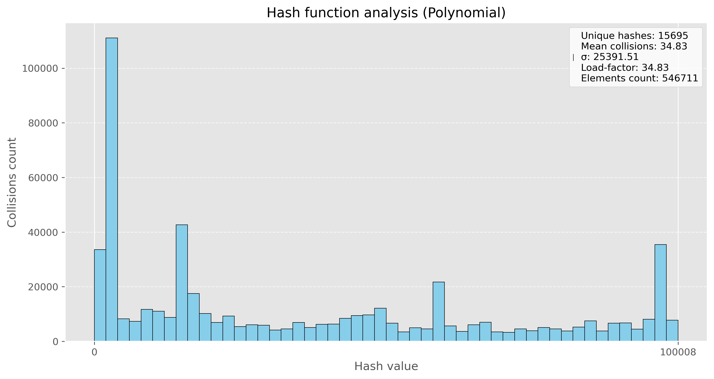

# HashTable

**Хеш-таблbца** — структура данных, реализующая интерфейс ассоциативного массива, а именно, она позволяет хранить пары (*ключ, значение*) и выполнять три операции: операцию добавления новой пары, операцию удаления и операцию поиска пары по ключу.

# Реализаци таблицы

Моя таблица работает с использованием метода цепочек (используется *двусвязный список*), в ней реализваны стандартные функции: вставка, удаление, поиск, ресайз. Таблица работает с строками, в качестве источника строк взято произведение *Джона Толкина "Властелин колец"*. 

**Постановка задачи:** необходимо провести 10 миллионов запросов поиска (тестовые данные создавались из слов исходного текста, а также из словаря английский слов), далее необходимо определить, какая из хэш-функций проявляет себя лучше, а также выполнить 3 вида оптимизации - ассемблерная вставка, использование интринсиков avx2, а также использование функции, написанной полностью на ассемблере.

# Анализ хэш-функций

В качестве хэш-функций для моей хэш таблицы были рассмотрены несколько стандартных вариантов:

*   Длина слова
*   Сумма ASCII кодов
*   Среднее значение ASCII кодов
*   Полиномиальное хэширование
*   DJB2
*   CRC32

Для наглядности были построены диаграммы количества коллизий на ключ, также расчитывалась дисперсия, у хорошей хэш-функции должно быть мало коллизий, а также низкая дисперсия.

1) **Длина слова**

Исползовать в качестве значения хэша - длину слова, явно не самый лучший вариант, потому что слова имеют ограниченную длину, а также большинство слов имеют одинаковую длину, что увеличивает число коллизий.

2) Сумма ASCII кодов

Эта функция уже проявила себя лучше другой, однако всё равно сумма кодов букв ограничена, а также разные слова (даже слова разной длины) могут иметь одинаковую сумма кодов букв, поэтому всё ещё имеем большое число коллизий.

3) Среднее значение ASCII кодов

Среднее значение кодов букв тоже не является хорошей хэш-функцией, так как при усреднении мы не только получаем ограниченный спектр значений, но и большое количество совпадений - коллизий.

4) Полиномиальное хэширование

Данный вид хэширования показал себя намного лучше всех предыдущих, мы видим, как уменьшилось среднее значение коллизий, однако всё ещё есть большие столбики на диаграмме, что показывает не совсем равномерное хэширование.

5) DJB2

Данная хэш-функция является довольно хорошей (за счёт изменения констант можно попробовать добиться улучшения), однако видим, что у нас имеются довольно большой разброс по столбикам, поэтому пока что это не самый оптимальный вариант.

6) CRC32

Будем использовать стандартную реализацию функции crc32, в результате получаем примерно одинаковое распределение значений хэшей, а тажке относительно невысокий показатель дисперсии.

В результате, мы получаем, что самой оптимальной функцией для хэширования моих строк является **CRC32**, у неё самые хорошие показатели по среднему числу коллизий, а также низкая дисперсия. В дальнейшем будем использовать именно её.

# Оптимизации хэш-таблицы

