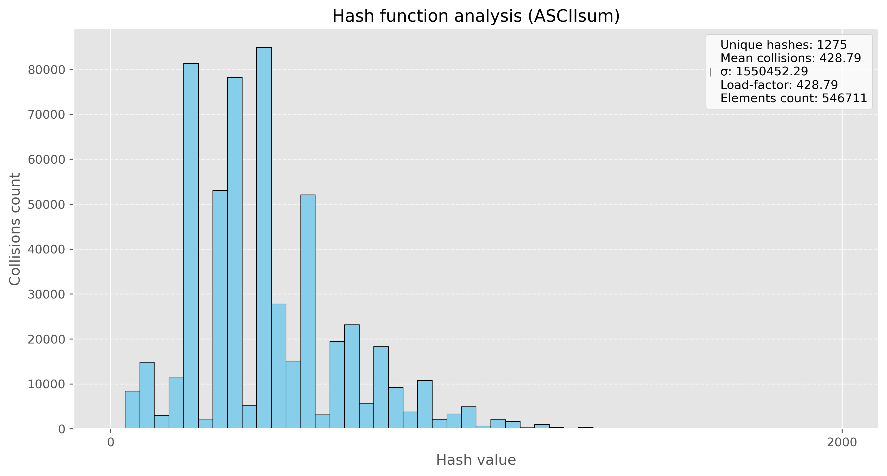

# **HashTable**


<div style="margin-right: 330px;">

**Хеш-таблbца** — структура данных, реализующая интерфейс ассоциативного массива, а именно, она позволяет хранить пары (*ключ, значение*) и выполнять три операции: операцию добавления новой пары, операцию удаления и операцию поиска пары по ключу.

# Реализации таблицы

Моя таблица работает с использованием метода цепочек (используется *двусвязный список*), в ней реализваны стандартные функции: вставка, удаление, поиск, ресайз. Таблица работает с строками, в качестве источника строк взято произведение *Джона Толкина "Властелин колец"*. 

**Постановка задачи:** необходимо провести 10 миллионов запросов поиска (тестовые данные создавались из слов исходного текста, а также из словаря английский слов), далее необходимо определить, какая из хеш-функций проявляет себя лучше, а также выполнить 3 вида оптимизации - ассемблерная вставка, использование интринсиков avx2, а также использование функции, написанной полностью на ассемблере.

# **Анализ хеш-функций**

В качестве хеш-функций для моей хеш таблицы были рассмотрены несколько стандартных вариантов:

*   Длина слова
*   Сумма ASCII кодов
*   Среднее значение ASCII кодов
*   Полиномиальное хеширование
*   DJB2
*   CRC32

Для наглядности были построены диаграммы количества коллизий на ключ, также расчитывалась дисперсия, у хорошей хеш-функции должно быть мало коллизий, а также низкая дисперсия.

1) **Длина слова**

Исползовать в качестве значения хеша - длину слова, явно не самый лучший вариант, потому что слова имеют ограниченную длину, а также большинство слов имеют одинаковую длину, что увеличивает число коллизий.


2) **Сумма ASCII кодов**

Эта функция уже проявила себя лучше другой, однако всё равно сумма кодов букв ограничена, а также разные слова (даже слова разной длины) могут иметь одинаковую сумма кодов букв, поэтому всё ещё имеем большое число коллизий.



3) **Среднее значение ASCII кодов**

Среднее значение кодов букв тоже не является хорошей хеш-функцией, так как при усреднении мы не только получаем ограниченный спектр значений, но и большое количество совпадений - коллизий.


4) **Полиномиальное хеширование**

Данный вид хеширования показал себя намного лучше всех предыдущих, мы видим, как уменьшилось среднее значение коллизий, однако всё ещё есть большие столбики на диаграмме, что показывает не совсем равномерное хеширование.


5) **DJB2**

Данная хеш-функция является довольно хорошей (за счёт изменения констант можно попробовать добиться улучшения), однако видим, что у нас имеются довольно большой разброс по столбикам, поэтому пока что это не самый оптимальный вариант.


6) **CRC32**

Будем использовать стандартную реализацию функции crc32, в результате получаем примерно одинаковое распределение значений хешей, а тажке относительно невысокий показатель дисперсии.


В результате, мы получаем, что самой оптимальной функцией для хеширования моих строк является **CRC32**, у неё самые хорошие показатели по среднему числу коллизий, а также низкая дисперсия. В дальнейшем будем использовать именно её.

# **Оптимизации хеш-таблицы**

Следующий этап работы заключался в оптимизации моей хеш-таблицы. Для этого необходимо было провести профилирование программы. Для этой задачи я использовал профилировщик `valgrind`.

```shell
# Сборка проекта
make   

# Вызов профилировщика
valgrind --tool=callgrind ./build/hashtable 

# Показ результатов
kcachegrind callgrind.out
```

В результате профилирования было выявлено, что *функция crc32 для подсчёта хеша работает достаточно долго*. Поэтому было принято решение оптимизировать её.

Вот исходный код для той функции, а также результаты профилирования:

```c
size_t GetHashCRC32(KeyType* key) {
    assert(key != NULL && "Null pointer in hash function!\n");

    size_t size = strlen(key);
    size_t crc  = 0xffffffff;

	while (size-- != 0) {
        crc = (crc << 8) ^ crc32_table[((crc >> 24) ^ (size_t)*key) & 255];
        key++;
    }

    return crc;
}
```


Будем оптимизировать её с помощью **аппаратной реализации** функции `crc32` и ассемблерной вставки, также сделаем её `inline`-функцией:

```c
inline size_t GetHashCRC32(KeyType* key) {
    assert(key != NULL && "Null pointer in hash function!\n");

    size_t size = strlen(key);
    size_t crc  = 0xffffffff;
    
    for (size_t i = 0; i < size; i++) {
        asm volatile (
            "crc32b %1, %0"
            : "+r"(crc)
            : "rm"(*key)
        );
        key++;
    }

    return crc;
}
```

Результаты оптимизации можем увидеть на рисунке ниже:


Как видим, удалось снизить время выполнение функции подсчёта хеша (*self*), кроме того, снизился и показатель *Inclusive*, это означает, что функция помимо этого стала вызывать меньше других функций под собой.


Далее было принято решение немного оптимизировать функцию поиска `HashTableFind`, а именно оптимизировать функцию `strcmp`, которая часто вызывается в нём.

Исходный код функции поиска:

```c
Node* HashTableFind(Node* head, KeyType* find_key) {
    while (head != NULL) {
        if (strcmp(head->key, find_key) == 0) return head;
        head = head->next;
    }

    return NULL;
}
```

Чтобы ускорить функцию поиска, напишем свою `inline`-функцию для проверки равенства строк, которая будет использовать **SIMD интрукции**. 

```c
int MyAsmStrCmp(const char* str1, const char* str2) {
    assert(str1 != NULL && str2 != NULL);

    size_t len1 = strlen(str1);
    size_t len2 = strlen(str2);

    if (len1 != len2) return 1;  

    size_t i = 0;
    for (; i + 16 <= len1; i += 16) {
        __m128i xmm1 = _mm_loadu_si128((__m128i*)(str1 + i));
        __m128i xmm2 = _mm_loadu_si128((__m128i*)(str2 + i));
        __m128i cmp  = _mm_cmpeq_epi8(xmm1, xmm2);

        if (_mm_movemask_epi8(cmp) != 0xFFFF) 
            return 1; 
    }

    //* remained bytes
    for (; i < len1; ++i) {
        if (str1[i] != str2[i])
            return 1;
    }

    return 0;  
}
```


