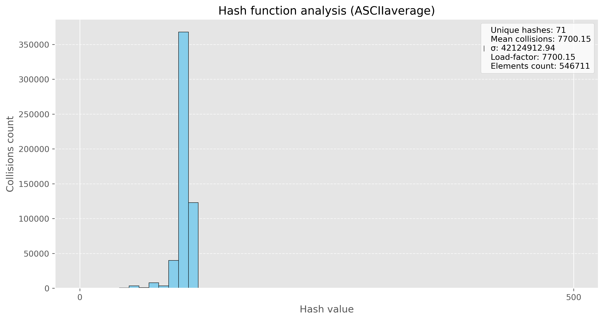

# **HashTable**


<div style="margin-right: 330px;">

**Хеш-таблица** — структура данных, реализующая интерфейс ассоциативного массива, а именно, она позволяет хранить пары (*ключ, значение*) и выполнять три операции: операцию добавления новой пары, операцию удаления и операцию поиска пары по ключу.

Ситуация, когда $key_1 \neq key_2$, но $h(key_1) = h(key_2)$ называется **коллизией**.

Существует достаточно много видов хеш-таблиц, среди которых *таблица с прямой адресацией, метод цепочек, таблицы с открытой адресацией, идеальное хеширование, хеширование кукушки*. В данной работе реализована **хеш-таблица на цепочках**.

# **Реализация таблицы**

Моя таблица работает с использованием метода цепочек (используется *двусвязный список*), в ней реализованы стандартные функции: вставка, удаление, поиск, ресайз. Таблица работает с строками, в качестве источника строк взято произведение *Дж. Р. Р. Толкина "Властелин колец"*. 

**Постановка задачи:** необходимо провести 10 миллионов запросов поиска (тестовые данные создавались из слов исходного текста, а также из словаря английских слов), далее необходимо определить, какая из хеш-функций проявляет себя лучше, а также выполнить 3 вида оптимизации - ассемблерная вставка, использование интринсиков, а также использование функции, написанной полностью на ассемблере.

# **Анализ хеш-функций**

В качестве хеш-функций для моей хеш таблицы были рассмотрены несколько стандартных вариантов:

*   **Длина слова**
*   **Сумма ASCII кодов**
*   **Среднее значение ASCII кодов**
*   **Полиномиальное хеширование**
*   **DJB2**
*   **CRC32**

Для наглядности были построены диаграммы количества коллизий на один ключ, также рассчитывалась дисперсия, у хорошей хеш-функции должно быть мало коллизий, а также низкая дисперсия.

# Длина слова

Использовать в качестве значения хеша - длину слова, явно не самый лучший вариант, потому что слова имеют ограниченную длину, а также большинство слов имеют одинаковую длину, что увеличивает число коллизий.


<details>
  <summary>Посмотреть исходный код хеш-функции</summary>

    size_t GetHashWordLength(KeyType* key) {
        assert(key != NULL);
    
        return strlen((const char*)key);
    }

</details>

# Сумма ASCII кодов

Эта функция уже проявила себя лучше другой, однако всё равно сумма кодов символов ограничена, а также разные слова (даже слова разной длины) могут иметь одинаковую сумма кодов символов, поэтому всё ещё имеем большое число коллизий.


<details>
  <summary>Посмотреть исходный код хеш-функции</summary>
    
    size_t GetHashASCIISum(KeyType* key) {
        assert(key != NULL);

        size_t len = strlen(key);
        size_t sum = 0;

        for (size_t i = 0; i < len; i++) {
            sum += (size_t)key[i];
        }

        return sum;
    }

</details>

# Среднее значение ASCII кодов

Среднее значение кодов букв тоже не является хорошей хеш-функцией, так как при усреднении мы не только получаем ограниченный спектр значений, но и большое количество совпадений - коллизий.



<details>
  <summary>Посмотреть исходный код хеш-функции</summary>
    
    size_t GetHashASCIIAverage(KeyType* key) {
        assert(key != NULL);

        size_t len = strlen(key);
        size_t sum = 0;

        for (size_t i = 0; i < len; i++) {
            sum += (size_t)key[i];
        }

        return sum / len;
    }

</details>

# Полиномиальное хеширование

Данный вид хеширования показал себя намного лучше всех предыдущих, мы видим, как уменьшилось среднее значение коллизий, однако всё ещё есть большие столбики на диаграмме, что показывает не совсем равномерное хеширование.

<details>
  <summary>Посмотреть исходный код хеш-функции</summary>
    
    for (; *key; ++key) {
        hash = hash * 31 + (unsigned char)*key;
    }

</details>


# DJB2

Данная хеш-функция является довольно хорошей (за счёт изменения констант можно попробовать добиться улучшения), однако видим, что у нас имеются довольно большой разброс значений, поэтому пока что это не самый оптимальный вариант.


<details>
  <summary>Посмотреть исходный код хеш-функции</summary>

    size_t GetHashDJB2(KeyType* key) {
        assert(key != NULL);

        size_t hash = 1379;
        int       c = 0;

        while ((c = *key++)) {
            hash = ((hash << 5) + hash) + (size_t)c; 
        }

        return hash;
    }

</details>

# CRC32

Будем использовать стандартную реализацию функции crc32, в результате получаем примерно одинаковое распределение значений хешей, а также относительно невысокий показатель дисперсии.


<details>
  <summary>Посмотреть исходный код хеш-функции</summary>
    
    size_t GetHashCRC32Default(KeyType* key) {
        assert(key != NULL);

        size_t size = strlen(key);
        size_t crc  = 0xffffffff;

	    while (size-- != 0) {
            crc = (crc << 8) ^ crc32_table[((crc >> 24) ^ (size_t)*key) & 255];
            key++;
        }

        return crc;
    }
</details>

|          Хеш-функция           | Количество уникальных хешей | Среднее число коллизий | Дисперсия |
|:------------------------------:|:---------------------------:|:----------------------:|:---------:|
|   Длина слова                  |            17               |         32159          | 463092473 |
|   Сумма ASCII кодов            |            1275             |          428           |  1550452  |
|   Среднее значение ASCII кодов |            71               |          7700          | 42124912  |
|   Полиномиальное хеширование   |            15695            |          34.8          |   25391   |
|   DJB2                         |            15674            |          34.9          |   25488   |
|   CRC32                        |            15672            |          34.9          |   25394   |

В результате, мы получаем, что наиболее оптимальной функцией для хеширования моих строк является **CRC32**, у неё самые хорошие показатели по среднему числу коллизий, а также низкая дисперсия. В дальнейшем будем использовать именно её.

# **Оптимизации хеш-таблицы**

Перед началом реализации собственных оптимизаций были проведены попытки ускорить программу путём добавления/удаления различных **флагов компиляции**. Для начала рассмотрим базовый вариант (с флагом оптимизаций `-O0`, а также в режиме дебага):


Как видим, не совсем то, что хотелось бы видеть, давайте попробуем ускорить программу - добавим флаг `-O1`, а также уберём ненужные флаги и выключим режим дебага:


Стало лучше, однако можем добиться результата получше. Для этого **оставим только флаг `-O2`**:


Результаты измерений запишем в таблицу, будем считать ускорение относительно предыдущей версии, а также относительно самой первой (базовой версии):

| Стадия оптимизации | Среднее время работы (в тактах) | Ускорение относительно предыдущей версии (в процентах) | Ускорение относительно базовой версии (в процентах)|
|:------------------:|:-----------------------:|:----------------------------------------:|:-------------------------------------:|
|   Базовая версия   |       6142775058        |                    -                     |             -                         |
|   -O1              |       5013458683        |                  18.4%                   |           18.4%                       |
|   -O2              |       3941732306        |                  21.4%                   |           35.8%                       |
                             
# **Оптимизации, не использующие флаги компиляции**

Следующий этап работы заключался в оптимизации моей хеш-таблицы. Для этого необходимо было провести профилирование программы. Для этой задачи я использовал утилиту `valgrind`, а если конкретнее, то `callgrind` (**Callgrind** — это инструмент в составе valgrind для профилирования программ. Он анализирует вызовы функций, собирая статистику о количестве выполненных инструкций, времени выполнения и об иерархии вызовов).

Все тесты будем проводить по 5 раз и усреднять результат, все тесты проводились на моёй машине, подробнее об этом [здесь](#итоги-и-информация-о-тестирующей-машине). Будем смотреть на рещультаты профилирования и оптимизировать функцию, которая вызывалась наибольшее количество раз (то есть сортировка по полю *self* в `valgrind`).

```shell
# Сборка проекта
make   

# Вызов профилировщика
valgrind --tool=callgrind ./build/hashtable 

# Показ результатов
kcachegrind callgrind.out
```

Вот результаты замеров **для самой последней версии** программы:


В результате профилирования было выявлено, что *функция crc32 для подсчёта хеша работает достаточно долго*. Поэтому было принято решение оптимизировать её.

Вот исходный код функции, которую мы сейчас будем оптимизировать:

```c
size_t GetHashCRC32Default(KeyType* key) {
    assert(key != NULL);

    size_t size = strlen(key);
    size_t crc  = 0xffffffff;

	while (size-- != 0) {
        crc = (crc << 8) ^ crc32_table[((crc >> 24) ^ (size_t)*key) & 255];
        key++;
    }

    return crc;
}
```

Будем оптимизировать её с помощью **аппаратной поддержки** функции `crc32` и ассемблерной вставки, также сделаем её `inline`-функцией:

```c
size_t GetHashCRC32Optimize(KeyType* key) {
    assert(key != NULL);

    size_t size = strlen(key);
    size_t crc  = 0xffffffff;
    
    for (size_t i = 0; i < size; i++) {
        asm volatile (
            "crc32b %1, %0"
            : "+r"(crc)
            : "rm"(*key)
        );
        key++;
    }

    return crc;
}
```

Результаты оптимизации можем увидеть на рисунке ниже:


Как видим, удалось снизить время выполнение функции подсчёта хеша (*self*), также мы видим, что функция стала вызывать меньше других функций под собой.

Теперь запустим тот же тест для нашей хеш-таблицы.


Вот табличка с сравнением относительно предыдущих результатов:

| Стадия оптимизации | Среднее время работы (в тактах) | Ускорение относительно предыдущей версии (в процентах) | Ускорение относительно базовой версии (в процентах)|
|:------------------:|:-----------------------:|:----------------------------------------:|:-------------------------------------:|
|   Базовая версия   |       6142775058        |                    -                     |             -                         |
|   -O1              |       5013458683        |                  18.4%                   |           18.4%                       |
|   -O2              |       3941732306        |                  21.4%                   |           35.8%                       |
|  crc32 optimize    |       3482656359        |                  11.6%                   |           43.3%                       |


Далее было принято решение немного оптимизировать функцию поиска `HashTableFind`, а именно оптимизировать функцию `strcmp`, которая часто вызывается в нём.

Исходный код функции поиска:

```c
Node* HashTableFind(Node* head, KeyType* find_key) {
    while (head != NULL) {
        if (strcmp(head->key, find_key) == 0) return head;
        head = head->next;
    }

    return NULL;
}
```

Чтобы ускорить функцию поиска, напишем свою функцию для проверки равенства строк, которая будет использовать **SIMD-инструкции**. Для ускорения будем выравнивать данные по 16, также будем **хранить в первых двух байтах строки её длину**, это позволит сразу обнаруживать несовпадающие строки. 

```c
int MyAsmStrCmp(KeyType* str1, KeyType* str2) {
    assert(str1 != NULL);
    assert(str2 != NULL);

    uint32_t len1 = *((uint32_t*)str1);
    uint32_t len2 = *((uint32_t*)str2);

    if (len1 != len2) return 1;

    const char* s1 = str1 + LENGTH_FIELD_SIZE;
    const char* s2 = str2 + LENGTH_FIELD_SIZE;

    size_t i = 0;
    for (; i + LEN_ALIGNMENT <= len1; i += LEN_ALIGNMENT) {
        __m128i xmm1 = _mm_loadu_si128((__m128i*)(s1 + i));
        __m128i xmm2 = _mm_loadu_si128((__m128i*)(s2 + i));
        __m128i cmp  = _mm_cmpeq_epi8(xmm1, xmm2);

        if (_mm_movemask_epi8(cmp) != 0xFFFF) 
            return 1; 
    }

    for (; i < len1; ++i) {
        if (s1[i] != s2[i])
            return 1;
    }

    return 0;
}
```

Теперь функция поиска примет вид:

```c
Node* HashTableFind(Node* head, KeyType* find_key) {
    while (head != NULL) {
        if (MyAsmStrCmp(head->key, find_key) == 0) return head;
        head = head->next;
    }
    return NULL;
}
```

Кроме того было решено немного оптимизировать подсчёт остатка от деления на `ht->capacity` при получении хеша, так как операция `%` является достаточно медленной (10-30 тактов). Предлагается сделать размер хеш-таблицы степенью двойки и тогда вместо использования `%` можно будет просто сделать `hash & (ht->capacity - 1)`. Операции вычитания и побитового И стоят значительно меньше (1-3 и 1 такт соответственно).

Итого получаем следующий результат:


| Стадия оптимизации | Среднее время работы (в тактах) | Ускорение относительно предыдущей версии (в процентах) | Ускорение относительно базовой версии (в процентах)|
|:------------------:|:-----------------------:|:----------------------------------------:|:-------------------------------------:|
|   Базовая версия   |       6142775058        |                    -                     |             -                         |
|   -O1              |       5013458683        |                  18.4%                   |           18.4%                       |
|   -O2              |       3941732306        |                  21.4%                   |           35.8%                       |
|  crc32 optimize    |       3482656359        |                  11.6%                   |           43.3%                       |
|  MyStrCmp          |       3319376591        |                   4.7%                   |           45.9%                       | 

Последний этап оптимизации - необходимо было написать функцию на ассемблере и использовать её в своей программе. После анализа программы было решено попытаться ускорить работу функции `GetHashCRC32Optimize`, давайте посмотрим ещё раз на её код:

```c
size_t GetHashCRC32Optimize(KeyType* key) {
    assert(key != NULL);

    size_t size = strlen(key);
    size_t crc  = 0xffffffff;
    
    for (size_t i = 0; i < size; i++) {
        asm volatile (
            "crc32b %1, %0"
            : "+r"(crc)
            : "rm"(*key)
        );
        key++;
    }

    return crc;
}
```

Что если попробовать написать **свою функцию определения длины строки**? Именно так подумал я и сразу же пошёл реализовывать это. В результате была написана такая простая версия `my_strlen`, которую я затем использовал в хеш-функции:

```asm
section .text
global my_strlen

my_strlen:
    xor rax, rax

.loop:
    cmp BYTE [rdi + rax], 0
    je .end
    inc rax
    jmp .loop

.end:
    ret
```

Результаты вы можете видеть ниже:


Да, время работы значительно увеличилось, но, попробовав запустить отдельно от предыдущей оптимизации (MyAsmStrCmp), я получил довольно интересный результат:


Помимо всего, было предложено запустить программу с флагом компиляции `-O3` и посмотреть, удалось ли хоть немного приблизиться к нему. На моё удивление результаты тестов для такого запуска оказались весьма близки к моим, полученным ранее:


# **Итоги и информация о тестирующей машине**

Вся работа проводилась на моём ноутбуке - 8-ядерном процессоре Intel Core i5-13500H (дистрибутив Linux- Ubuntu), во время тестов была выставлена тактовая частота 2500 МГц.

```
yan@yan03f:~/projects/HashTable$ lscpu
Architecture:             x86_64
  CPU op-mode(s):         32-bit, 64-bit
  Address sizes:          39 bits physical, 48 bits virtual
  Byte Order:             Little Endian
CPU(s):                   16
  On-line CPU(s) list:    0-15
Vendor ID:                GenuineIntel
  Model name:             13th Gen Intel(R) Core(TM) i5-13500H
    CPU family:           6
    Model:                186
    Thread(s) per core:   2
    Core(s) per socket:   12
    Socket(s):            1
    Stepping:             2
    CPU(s) scaling MHz:   18%
    CPU max MHz:          4700.0000
    CPU min MHz:          400.0000

```

В ходе работы была написана и оптимизирована хеш-таблица с методом цепочек, был проведён анализ различных хеш-функций. С помощью различных видов оптимизаций код стал немного менее читаемым, однако это хорошо сказалось на времени работы программы.

Наибольшее ускорение относительно базовой версии - $\frac{6142775058}{400399296} \approx 15.3$. Всего была написана 31 строчка на ассемблере/с использованием интринсиков. Также был подсчитан так называемый **коэффициент оптимизации**, он составил:

$\alpha = \frac{}{} \cdot 100 = \frac{15.3}{31} \cdot 100 \approx 49.4$

# **Список литературы и других источников**

* Брайант Р., О’Халларон Д. Компьютерные системы: Архитектура и программирование. Взгляд разработчика. — 3-е изд. — М.: Диалектика, 2021. — 1088 с.
* Кормен Т., Лейзерсон Ч., Ривест Р., Штайн К. Алгоритмы: построение и анализ. — 3-е изд. — М.: Вильямс, 2022. — 1328 с.
* Исходный код CRC32 из репозитория GCC // [GitHub](https://github.com/gcc-mirror/gcc/blob/master/libiberty/crc32.c)
* Словарь английских слов // [GitHub](https://github.com/dwyl/english-words)
* Руководство по интринсикам // [Intel Intrinsics Guide](https://www.laruence.com/sse/)